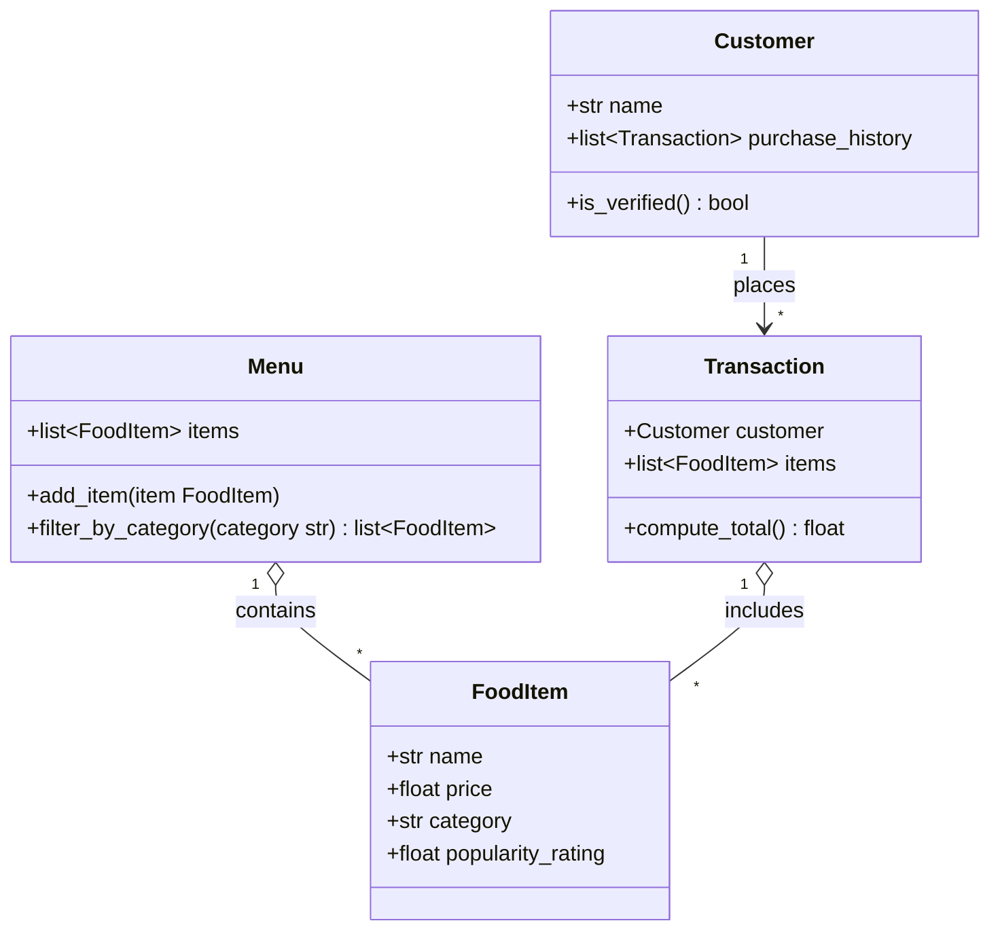

# ByteBites Class Diagram (DRAFT)

```mermaid
classDiagram
    class Customer {
        +str name
        +list~Transaction~ purchase_history
        +is_verified() bool
    }
    class FoodItem {
        +str name
        +float price
        +str category
        +float popularity_rating
    }
    class Menu {
        +list~FoodItem~ items
        +add_item(item FoodItem)
        +filter_by_category(category str) list~FoodItem~
    }
    class Transaction {
        +Customer customer
        +list~FoodItem~ items
        +compute_total() float
    }

    Menu "1" o-- "*" FoodItem : contains
    Customer "1" --> "*" Transaction : places
    Transaction "1" o-- "*" FoodItem : includes
```
